# spring_mircroservices_in_action

## 1.云与Spring

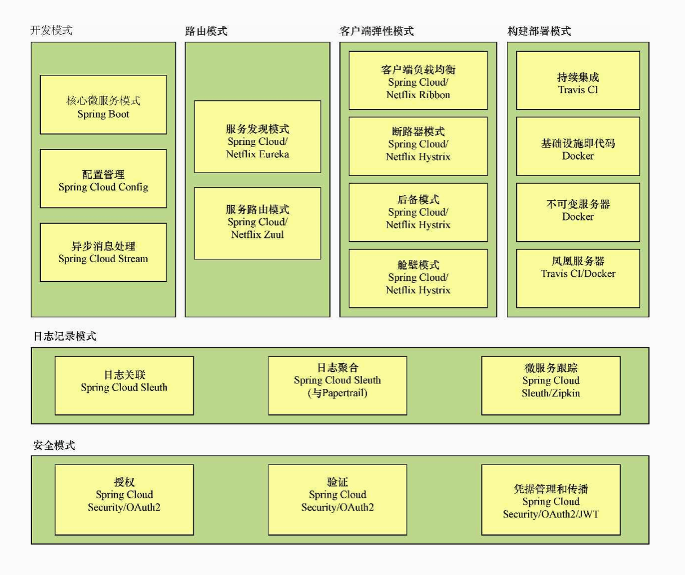

1. 核心微服务开发模式

        解决构建微服务的基础问题

    - 服务粒度
    - 通信协议
    - 接口设计
    - 服务的配置管理
    - 服务之间的事件处理

        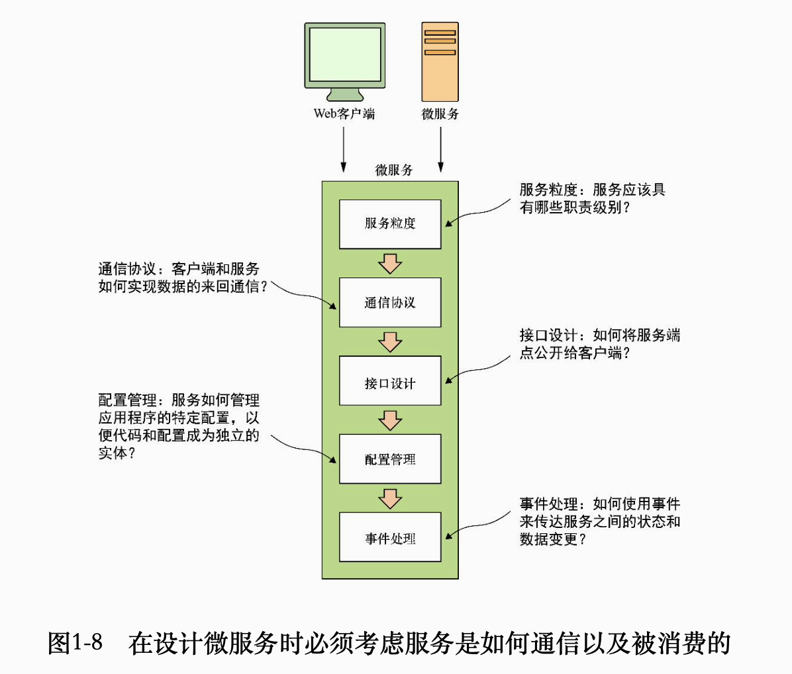

2. 微服务路由模式

        如何将客户的服务请求发送到服务的特定实例？
    
    - 服务发现
    - 服务路由

        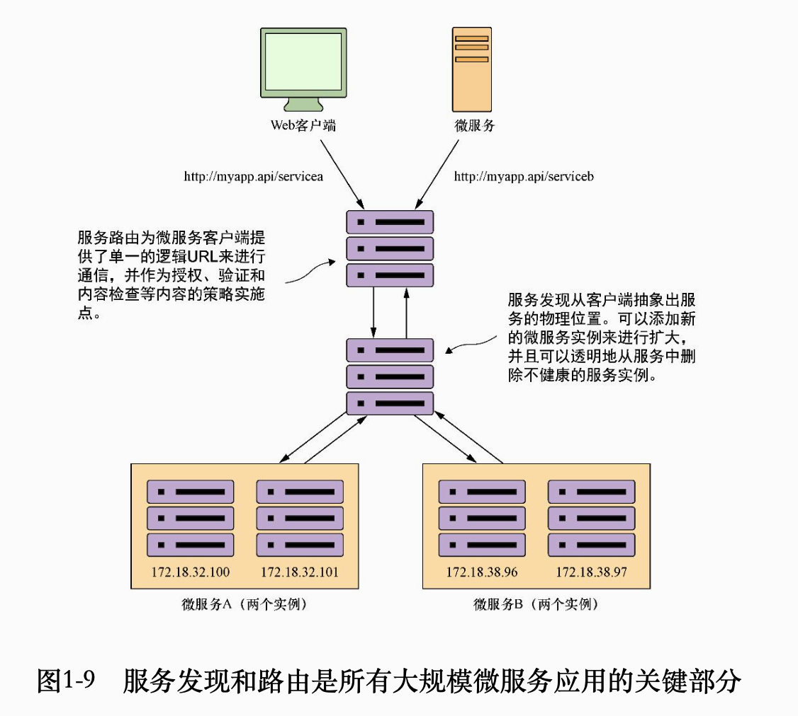

3. 微服务客户端弹性模式

        防止单个服务（或服务实例）中的问题级联暴露给服务的消费者

    - 客户端负载均衡
    - 断路器模式（确保客户端不会重复调用出现故障的服务）
    - 后备模式（在客户端失败时，客户端能否采用另一种方法来采取行动）
    - 舱璧模式（如何在客户端上隔离不同的服务调用，以确保表现不佳的服务不占用客户端上的所有资源）

        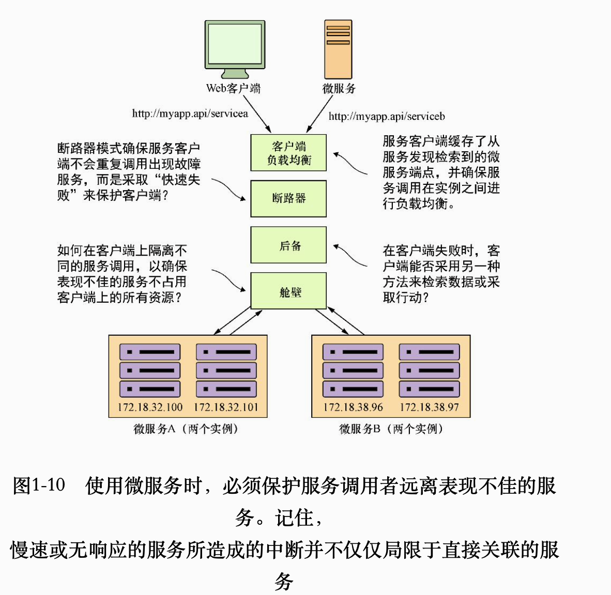

4. 微服务安全模式

    - 验证（如何确定调用服务的客户端就是它们声称的那个主体）
    - 授权（如何确定调用微服务的客户端是否允许执行它们正在进行的操作）
    - 凭据管理和传播（如何避免客户端每次都要提供凭据信息才能访问事务中涉及的服务调用）

        

5. 微服务日志记录和跟踪模式

        微服务的缺点是调式和跟踪应用程序和服务中发生的事情要困难得多
        
    - 日志关联（一个用户事务会调用多个服务，如何将这些服务所生成的日志关联到一起？）
    - 日志聚合（如何将微服务生成的所有日志合并到一个可查询的数据库中）
    - 微服务跟踪（如何在涉及的所有服务中可视化客户端事务的流程，并了解其性能特征）

        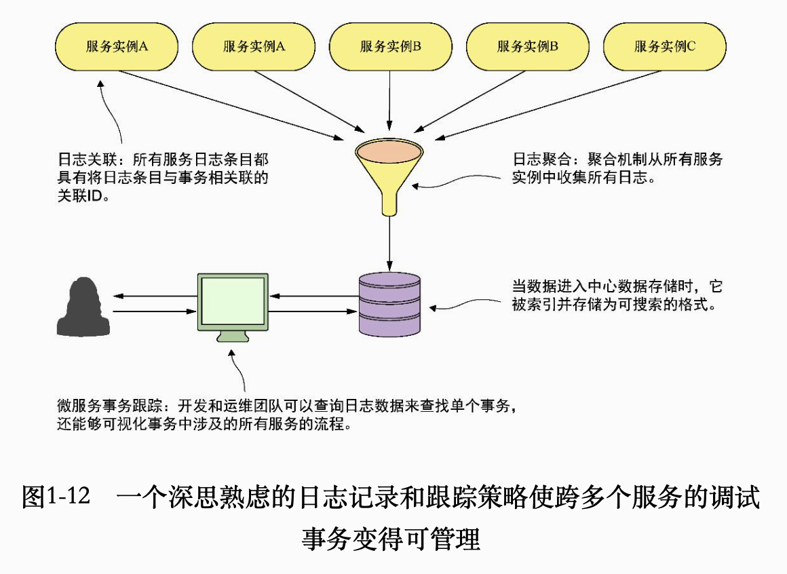

6. 微服务构建和部署模式

    - 构建和部署管道（如何创建一个可重复的构建和部署过程，只需一键即可构建部署到任何环境）
    - 基础设施即代码（如何将服务的基础设施作为可以在源代码管理下的代码去对待）
    - 不可变服务器（一旦创建了微服务镜像，如何确保它在部署之后永远不会更改）
    - 凤凰服务器（配置漂移问题：如何确保运行微服务的服务器定期被拆卸，并重新创建一个不可变的镜像）

        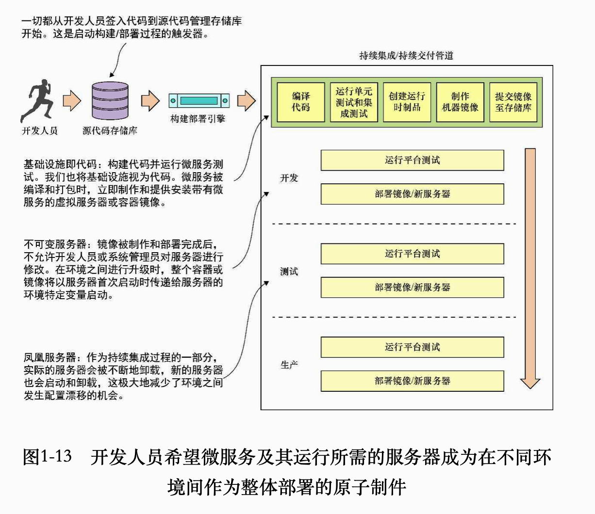

## 2. 使用Spring Boot构建微服务

应用程序是服务的集合，每个服务只做一件事，并只做好一件事。

架构师在软件项目中的作用是提供待解决问题的工作模型：
- 分解业务问题（描述业务的名词/主义业务动词/寻找数据内聚）
- 建立服务粒度（微服务是业务逻辑的表达，而不是数据源的抽象层）
- 定义服务接口（REST理念/使用URI传达意图/请求响应使用JSON/HTTP状态码传达状态）

微服务架构需要高度的运维成熟度。

在微服务间执行事务没有标准。

成功的微服务架构需要强大的应用程序开发和DevOps实践：
- 代码库（所有应用程序代码和服务器供应信息都应该处于版本控制中）
- 依赖（通过构建工具明确声明应用程序使用的依赖项机器版本号）
- 配置（将应用程序配置与代码分开存储（特别是特定于环境的配置））
- 后端服务（微服务通常通过网络与数据库或消息系统进行通信，这些服务更换为第三方服务应该是低成本的）
- 构建、发布和运行（保持部署的应用程序的构建、发布和运行完全分开）
- 进程（微服务应该始终是无状态的，它们可以在任何超时时被杀死和替换）
- 端口绑定（打包的时候完全独立，服务应该在命令行上自行启动，并通过公开的HTTP端口提供访问）
- 并发（需要扩展时不依赖单个服务的线程模型，而是可以启动更多实例水平扩展）
- 可任意处理（可根据需要启动和停止，最小化启动时间，kill信号能正常关闭进程）
- 开发环境与生产环境等同
- 日志
- 管理进程（数据移植或转换应该通过源代码库管理和维护的脚本来完成，可重复执行）

## 3. 使用Spring Config

应用程序配置数据需要跟踪和版本控制，管理不当的应用程序配置很容易滋生难以检测的Bug。

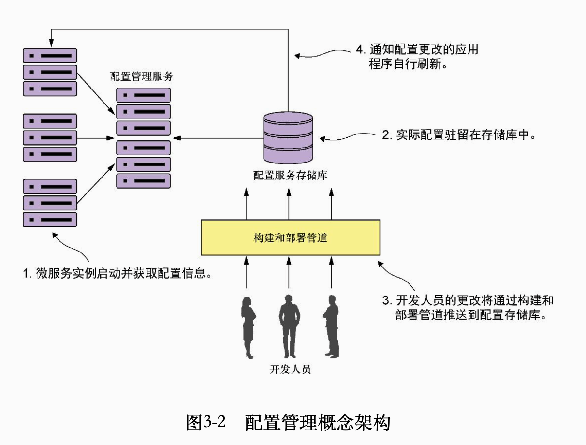

不要在大型云应用中使用基于文件系统的解决方案，因为这意味着要为所有云配置服务器实现共享文件挂载点。

## 4. 服务发现Spring Service Discovery

## 5. 使用Spring Cloud和Netflix Hystrix的**客户端弹性模式**

在应用程序的每一层构建冗余，只解决了构建弹性系统的一小部分问题。当服务奔溃时，很容易检测到该服务已经不在了，因此程序可以绕过它；然而，当服务运行缓慢时，检测到这个服务性能不佳并绕过它是非常困难的。

性能不佳的远程服务不仅难以检测，还会触发连锁反应，从而影响整个应用程序生态系统。

客户端弹性软件模式的重点是，在远程服务发生错误或表现不佳时保护调用的客户端免于奔溃，让客户端“快速失败”，而不消耗诸如数据库连接和线程池之类的宝贵资源，防止远程服务器的问题向客户端等“上游”进行传播。

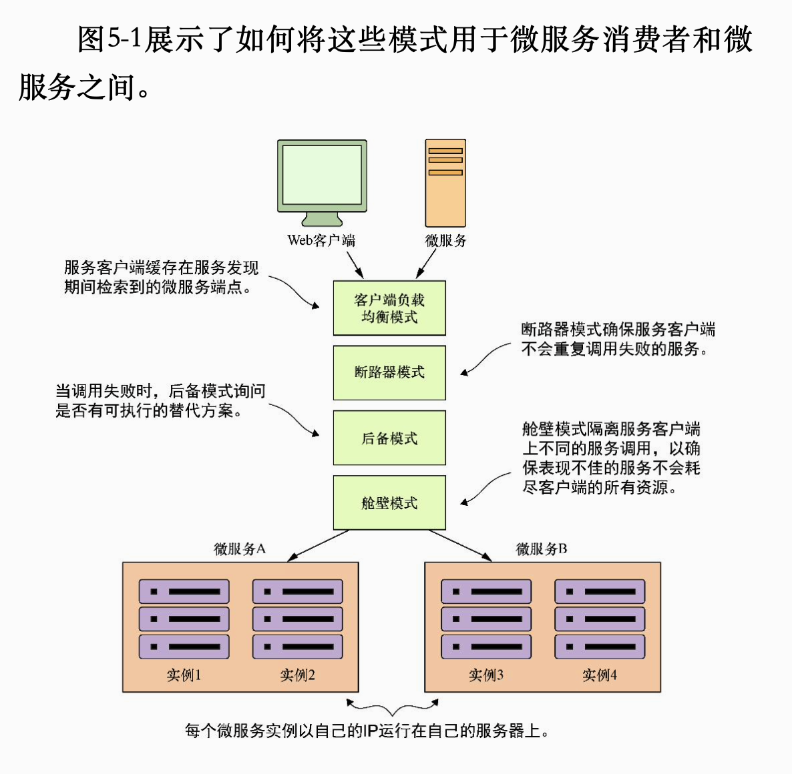

舱璧模式可以应用于必须与多个远程资源交互的服务，可把不同的远程资源的调用分到不同的线程池中，线程池充当服务的“舱璧”。如果一个服务响应缓慢，那么这种服务调用的线程池就会抱合并停止处理请求。

断路器会跟踪已发生故障的数量，如果在一定时间内某个服务发生了足够多的错误，那么断路器就会电路“跳闸”，即熔断。

断路器模式为远程调用提供的关键能力：快速失败、优雅地失败、无缝恢复。

构建断路器模式、后备模式和舱璧模式的实现需要对线程和线程管理有深入的理解。

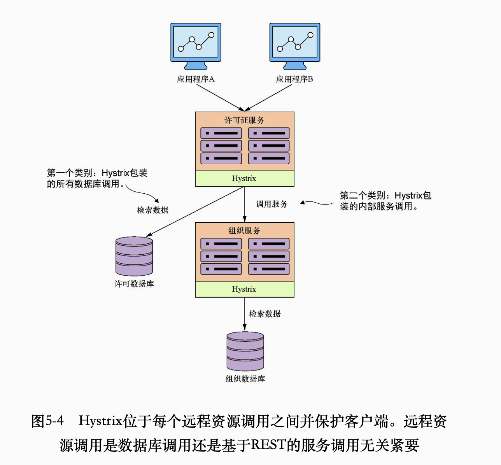

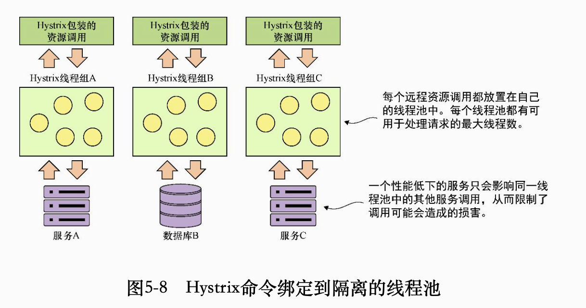

Hystrix 10s窗口检测是否触发断路器，触发之后开启一个5s窗口检测是否恢复重置检测窗口，其中10s/5s的窗口时间可配置，并且检测窗口内的最小请求数量和错误阈值比率也可以配置。

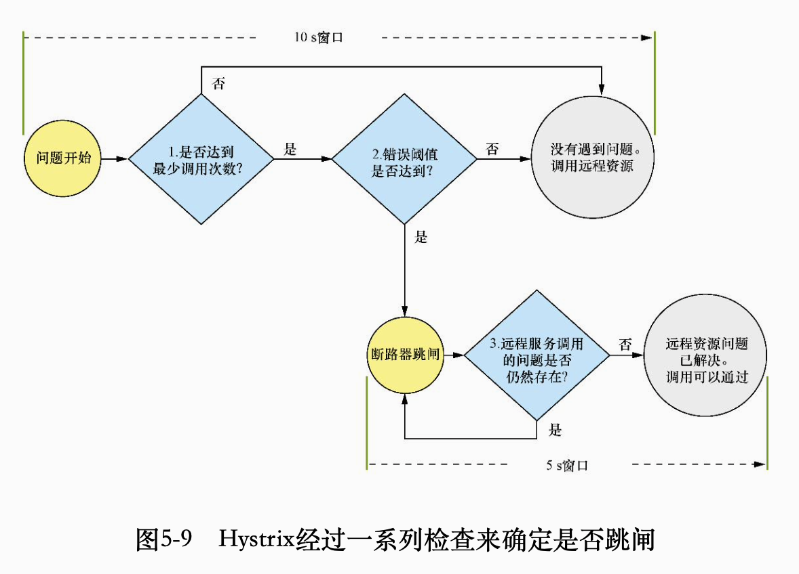

默认情况下，Hystrix标注的方法开启子线程执行，即隔离策略是 THREAD，此时父线程的context传递不到子线程里。

## 6. 使用Spring Cloud和Zuul进行服务路由

在多个微服务中，将共同的横切关注点抽象成一个独立且作为应用程序中所有微服务调用的过滤器和路由器的服务，这种横切关注点被称为服务网关（service gaterway）。服务客户端不再直接调用服务，取而代之的是，服务网关作为单个策略执行点，所有调用都通过服务网关进行路由，然后被路由到最终目的地。

Zuul的核心是一个反向代理。Zuul（反向代理）从客户端接收服务调用并将其转发给下游服务。

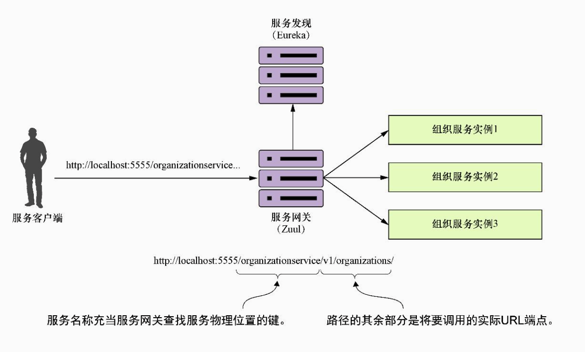

Zuul过滤器可以按照与J2EE servlet过滤器或Spring Aspect类似的方式来使用，后者被本地化为特定的服务，而使用Zuul过滤器允许开发人员为通过Zuul路由的所有服务实现横切关注点。

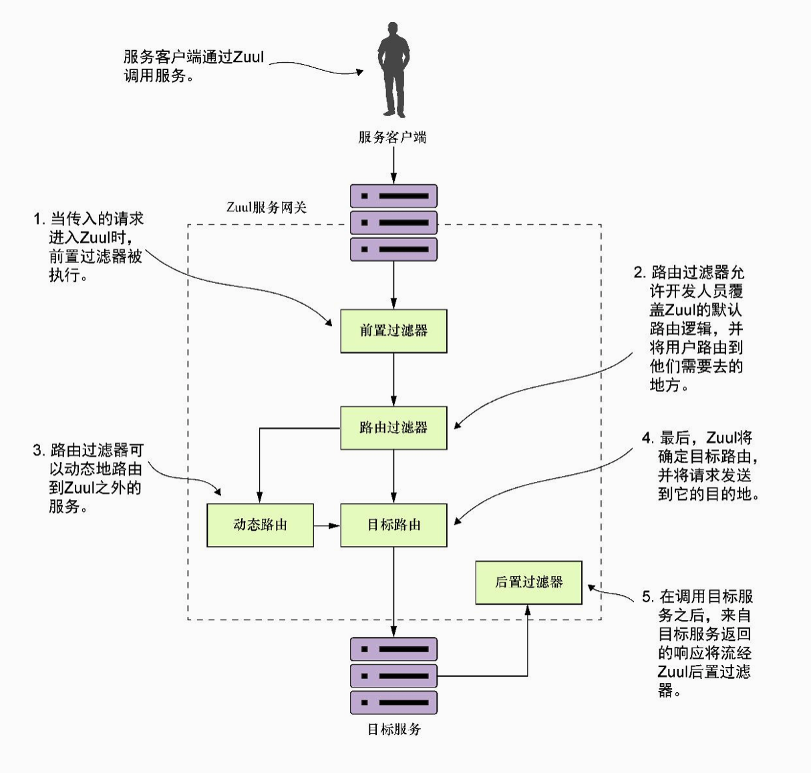

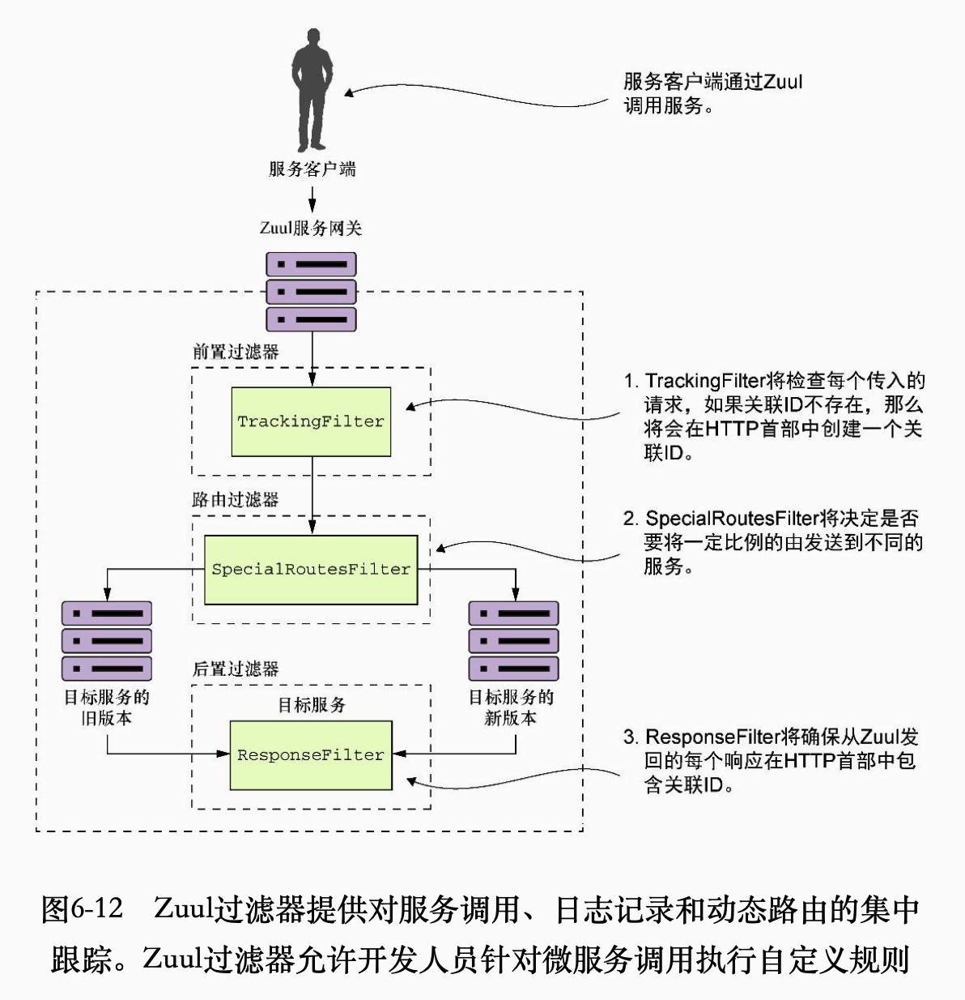

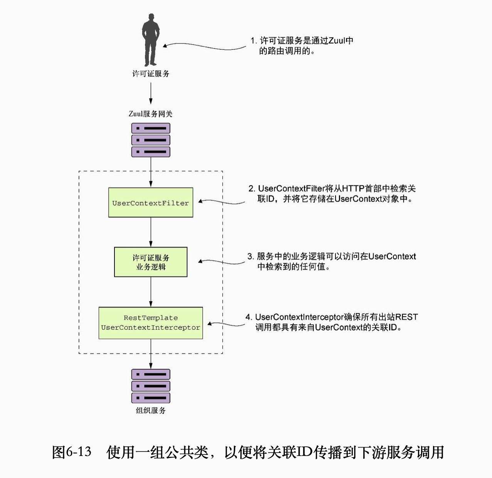

## 7. 保护微服务

OAuth2是一个基于令牌的安全验证和授权框架，它将安全性分解为4个部分：受保护资源、资源所有者、应用程序、OAuth2验证服务器。

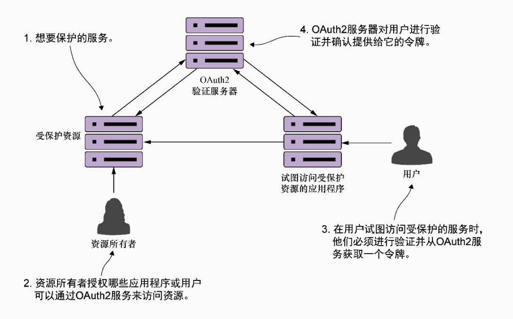

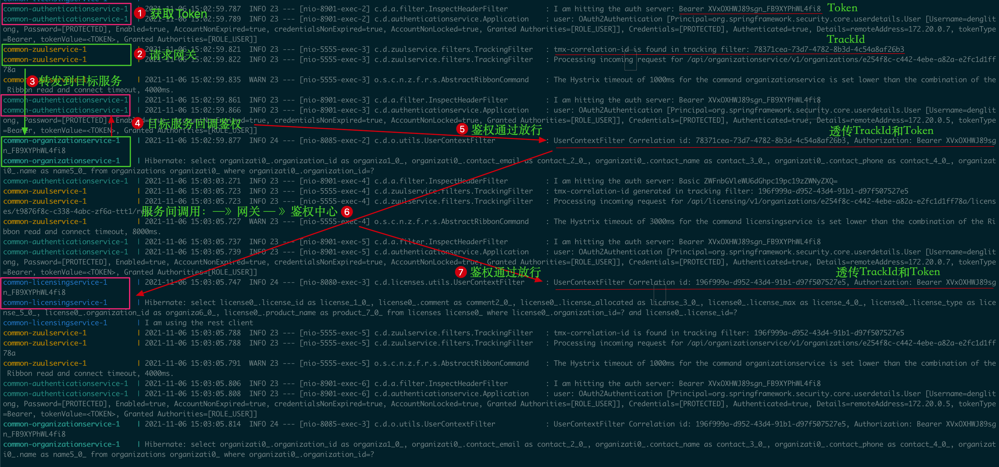
